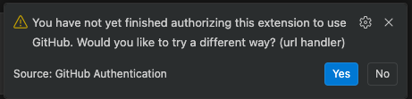

# GitHub Copilot Sandbox Template

Run GitHub Copilot CLI, or the Copilot VS Code extension in devcontainer mode, in a network-locked container. All outbound traffic is routed through an enforcing proxy that applies the project's network policy.

See the [main README](../../README.md) for installation, architecture overview, and configuration options.

## Setup

After running `agentbox init` (selecting "copilot") and starting the sandbox, authenticate Copilot on first run.

### Authenticate Copilot (first run only)

In CLI mode you should be able to `/login` as usual.

When using VS Code (devcontainer), you need to use the "URL handler" method.

[](../images/copilot-auth-vscode-ide.png)

Note: even in Devcontainer mode, VS Code will store the credentials on the host (removing the containers and volumes preserves them).

The IntelliJ Copilot plugin [cannot complete the authentication flow in a Devcontainer](https://github.com/microsoft/copilot-intellij-feedback/issues/1375),
so it's impossible to use it.

### Use Copilot CLI

Inside the container:

```bash
copilot
# or auto-approve mode:
copilot --yolo
```

Afterward, for CLI mode, stop the container:

```bash
agentbox compose down
```

### Use Copilot in VS Code

In devcontainer mode the Copilot Chat extension runs in the container's extension host, and VS Code starts the
Agent Host that powers Copilot sessions inside the container as well. Both the chat view and "New Copilot CLI
Session" therefore execute in the sandbox: tool calls, terminal commands, and model traffic go through the proxy
exactly as the CLI does.

The Agents window is not supported. VS Code cannot target a Dev Container from it
([microsoft/vscode#317380](https://github.com/microsoft/vscode/issues/317380)), and its remote path requires SSH or a
dev tunnel, both of which the sandbox blocks by design. Use the chat view or a CLI session from the Dev Container
window instead.

## Network policy and the GitHub API

The `copilot` proxy service allows `github.com` and `api.github.com` host-wide, because Copilot CLI talks to both
directly and authenticates with its own login (the `/login` flow above), not with a proxy-injected token.

That has two consequences for the repo-scoped GitHub `api` surface described in [docs/github.md](../github.md):

- It adds no reach in a Copilot sandbox. The baseline already permits every path and method on `api.github.com`, so
  the fixed `readwrite` allowlist does not constrain Copilot's own GitHub traffic.
- Proxy-side token injection for `gh api` does not work alongside it. The proxy applies the first rule that matches,
  and the baseline's host-wide catch-all is merged before user policy, so a request never reaches the repo-scoped
  rule that carries `api.auth`. Running `gh api` inside a Copilot sandbox therefore needs its own token in the
  container, which is the discouraged shape. Use a different agent's sandbox for proxy-injected `gh api`.
