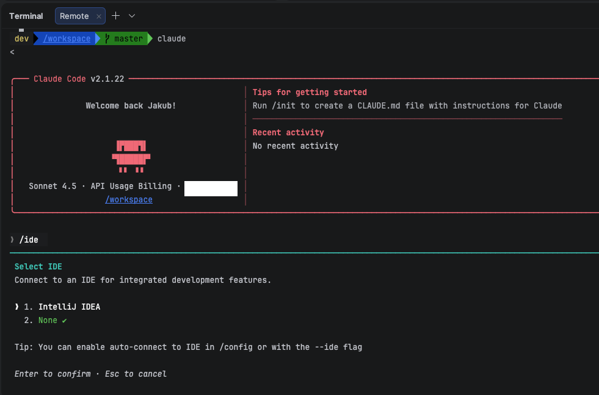
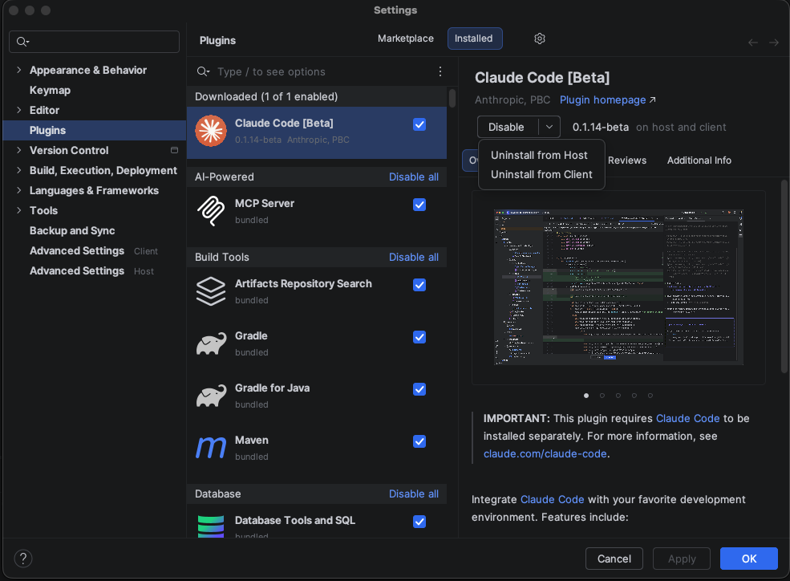
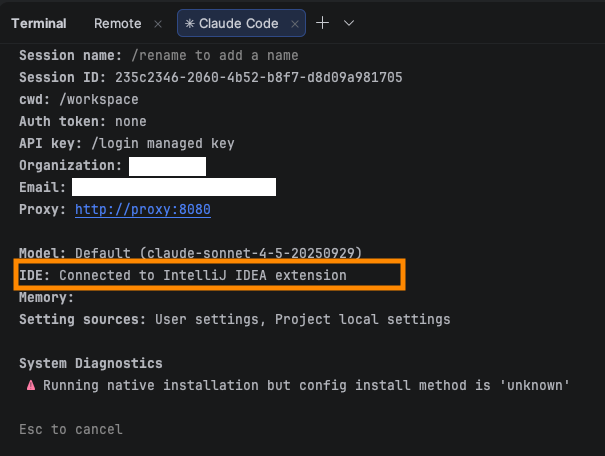

# Claude Code Sandbox Template

Run Claude Code in a network-locked container. All outbound traffic is routed through an enforcing proxy that blocks requests to domains not on the allowlist.

## Quick Start

### 1. Clone the agent-sandbox repo

```bash
git clone https://github.com/mattolson/agent-sandbox.git
```

### 2. Set up policy files

The network proxy reads a policy file on the host. Copy the examples:

```bash
mkdir -p ~/.config/agent-sandbox/policies
cp agent-sandbox/docs/policy/examples/claude* ~/.config/agent-sandbox/policies/
```

The compose files mount the appropriate policy:
- Docker Compose CLI mode uses `policies/claude.yaml`
- Devcontainer mode uses `policies/claude-devcontainer.yaml` (includes VS Code and JetBrains infrastructure domains)

### 3. Copy template to your project

#### Option A: Devcontainer (VS Code / JetBrains)

```bash
cp -r agent-sandbox/templates/claude/.devcontainer /path/to/your/project/
```

**VS Code:**
1. Install the Dev Containers extension
2. Command Palette > "Dev Containers: Reopen in Container"

**JetBrains (IntelliJ, PyCharm, WebStorm, etc.):**
1. Open your project
2. From the Remote Development menu, select "Dev Containers"
3. Select the devcontainer configuration

#### Option B: Docker Compose (CLI)

```bash
cp agent-sandbox/templates/claude/docker-compose.yml /path/to/your/project/
cd /path/to/your/project
docker compose up -d
docker compose exec agent zsh
```

### 4. Authenticate Claude (first run only)

Do **not** use the page that automatically opens in your browser. It will try to connect to localhost and fail. Instead:

1. Copy the URL and open it in your browser (this URL uses a different flow than the one that opens automatically)
2. Authorize the application
3. Paste the authorization code

[](../../docs/images/claude-auth-vscode-ide.png)
[](../../docs/images/claude-auth-vscode-terminal.png)

Credentials persist in a Docker volume. You only need to do this once per project.

### 5. Use Claude Code

Inside the container:

```bash
claude
# or to auto-approve all actions:
claude --dangerously-skip-permissions
```

Afterward, for compose mode, stop the container:

```bash
docker compose down
```

## Two Modes

This template supports two usage modes with separate compose files:

| Mode | Compose file | Policy | Use case |
|------|-------------|--------|----------|
| **Devcontainer** | `.devcontainer/docker-compose.yml` | Requires host mount | VS Code, JetBrains IDEs |
| **CLI** | `docker-compose.yml` | Baked-in default | Terminal/headless usage |

The separate compose files allow both modes to run simultaneously without container or volume name conflicts.

## Within devcontainer: Terminal vs IDE Extension

You can run Claude Code two ways with the devcontainer:

| Mode | How to start                                                   | IDE support |
|------|----------------------------------------------------------------|-------------|
| **Terminal** | Run `claude` in the integrated terminal                        | VS Code, JetBrains |
| **IDE extension** | `devcontainer.json` should install the extension automatically | VS Code, JetBrains |


### JetBrains IDE
The JetBrains IDE plugin has very limited features. 
Most of the work happens in the terminal, but it will allow you to review changes in the GUI diff viewer. 

To use this feature, make sure that "Open devcontainer projects natively" is **disabled** in "Advanced Settings"

To start, either click the Claude Code icon in the status bar or run `claude` from the (remote) terminal.
When Claude is running use `/ide` command to connect the IDE to Claude.

[](../../docs/images/idea-claude-connect.png)

If you encounter issues, make sure that the extension is installed on "host" (this is the container).

[](../../docs/images/idea-claude-plugin-on-host.png)

If you can see ` ❯ 1. IntelliJ IDEA ✔    ` after issuing `/ide` command, but the integration is not working, check the `/status`.
You should see `Connected to IntelliJ IDEA extension`, otherwise remove the Devcontainers containers and volumes and try again.

[](../../docs/images/idea-claude-plugin-connected.png)

### VS Code
In VS Code, both modes work with the sandbox container. The IDE extension runs a separately bundled claude binary, but the proxy and firewall apply equally because both binaries run inside the container and respect the `HTTP_PROXY` environment variable.

**Shared configuration.** Both modes use the same Claude credentials and settings stored in the Docker volume (`~/.claude`). You can switch between terminal and extension freely. Authenticate once in either mode and both will work.

**Feature differences.** The IDE extension provides tighter editor integration (inline suggestions, chat panel). The terminal provides the full CLI feature set. Use whichever fits your workflow, or both.

**First-time setup with extension.** If you start fresh with the extension (no prior authentication), the extension will prompt you to authenticate through its UI. This works the same as the terminal OAuth flow.

**Connecting terminal to IDE.** Running `/ide` in the terminal Claude session shows the connection status to VS Code. When connected, Claude can interact with the editor directly.

## How It Works

Two containers run as a Docker Compose stack:

1. **proxy** (mitmproxy) - Enforces a domain allowlist. Blocks HTTP and HTTPS requests to non-allowed domains with 403. Logs all traffic as JSON to stdout.
2. **agent** (Claude Code) - Your development environment. All HTTP/HTTPS traffic is routed through the proxy via `HTTP_PROXY`/`HTTPS_PROXY` env vars. An iptables firewall blocks any direct outbound connections, so traffic cannot bypass the proxy.

The proxy's CA certificate is automatically shared with the agent container and installed into the system trust store at startup.

## Network Policy

### Policy location

Policy files live on the host in `~/.config/agent-sandbox/policies/`. The compose files mount the appropriate policy:
- CLI: `policies/claude.yaml`
- Devcontainer: `policies/claude-devcontainer.yaml`

You can customize the volume mount, but policy files must live outside the workspace. If they were inside, the agent could modify its own allowlist.

### Customizing the policy

Edit your policy file to add project-specific domains:

```yaml
services:
  - github
  - claude
  - vscode  # Include for devcontainer mode

domains:
  # Add your own
  - registry.npmjs.org
  - pypi.org
```

Restart the proxy after changes: `docker compose restart proxy`

### Policy format

```yaml
services:
  - github  # Expands to github.com, *.github.com, *.githubusercontent.com
  - vscode  # Expands to VS Code infrastructure domains

domains:
  - api.anthropic.com      # Exact match
  - "*.example.com"        # Wildcard suffix match (also matches example.com)
```

### Available services

The proxy understands these service aliases that expand to multiple domains:

- `github` - github.com, *.github.com, *.githubusercontent.com
- `claude` - *.anthropic.com, *.claude.ai, *.claude.com, *.sentry.io, *.statsig.com
- `vscode` - VS Code marketplace and update infrastructure

## Verifying the Sandbox

```bash
# Inside container:

# Should fail with 403 (blocked by proxy)
curl -s -o /dev/null -w "%{http_code}" https://example.com

# Should succeed (GitHub is allowed)
curl -s https://api.github.com/zen

# Direct outbound bypassing proxy should also fail (blocked by iptables)
curl --noproxy '*' --connect-timeout 3 https://example.com
```

## Dotfiles

Mount your dotfiles directory to have them auto-linked into `$HOME` at container startup:

```yaml
volumes:
  - ${HOME}/.config/agent-sandbox/dotfiles:/home/dev/.dotfiles:ro
```

The entrypoint recursively walks `~/.dotfiles` and creates symlinks for each file at the corresponding `$HOME` path. Intermediate directories are created as needed.

For example, if your dotfiles contain:
```
.dotfiles/
  .zshrc
  .gitconfig
  .config/
    git/config
    starship.toml
```

The container will have:
- `~/.zshrc` -> `~/.dotfiles/.zshrc`
- `~/.gitconfig` -> `~/.dotfiles/.gitconfig`
- `~/.config/git/config` -> `~/.dotfiles/.config/git/config`
- `~/.config/starship.toml` -> `~/.dotfiles/.config/starship.toml`

Protected paths (`.config/agent-sandbox`) are never overwritten. Docker bind mounts (like individually mounted `CLAUDE.md`) take precedence over dotfile symlinks.

Shell.d scripts are sourced from the system-level zshrc (`/etc/zsh/zshrc`), which runs before `~/.zshrc`. This means your dotfiles can include a custom `.zshrc` without breaking agent-sandbox functionality.

## Shell Customization

Mount scripts into `~/.config/agent-sandbox/shell.d/` to customize your shell environment. Any `*.sh` files are sourced when zsh starts (before `~/.zshrc`).

```bash
mkdir -p ~/.config/agent-sandbox/shell.d

cat > ~/.config/agent-sandbox/shell.d/my-aliases.sh << 'EOF'
alias ll='ls -la'
alias gs='git status'
EOF
```

Uncomment the shell.d mount in the compose file you're using.

## Language Stacks

The base image ships installer scripts for common language stacks. Use them in a custom Dockerfile or via the `STACKS` build arg.

### Custom Dockerfile

```dockerfile
FROM ghcr.io/mattolson/agent-sandbox-claude:latest
USER root
RUN /etc/agent-sandbox/stacks/python.sh
RUN /etc/agent-sandbox/stacks/go.sh 1.23.6
USER dev
```

Build and use your custom image:
```bash
docker build -t my-claude-sandbox .
# Update docker-compose.yml to use image: my-claude-sandbox
```

### STACKS build arg

If building from source, use the `STACKS` env var. Stacks are installed in the base image, so build with `all` or build base first:

```bash
STACKS="python,go:1.23.6" ./images/build.sh all
```

### Available stacks

| Stack | Script | Version arg | Default |
|-------|--------|-------------|---------|
| Python | `python.sh` | (ignored, uses apt) | System Python 3 |
| Node.js | `node.sh` | Major version | 22 |
| Go | `go.sh` | Full version | 1.23.6 |
| Rust | `rust.sh` | Toolchain | stable |

Each script handles both amd64 and arm64 architectures.

## Image Versioning

By default, the template pulls `:latest`. For reproducibility, pin to a specific digest:

```yaml
image: ghcr.io/mattolson/agent-sandbox-claude@sha256:<digest>
image: ghcr.io/mattolson/agent-sandbox-proxy@sha256:<digest>
```

To find the current digest:

```bash
docker pull ghcr.io/mattolson/agent-sandbox-claude:latest
docker inspect --format='{{index .RepoDigests 0}}' ghcr.io/mattolson/agent-sandbox-claude:latest
```

To use locally-built images instead:

```bash
cd agent-sandbox && ./images/build.sh
# Then update the compose file to use:
#   image: agent-sandbox-claude:local
#   image: agent-sandbox-proxy:local
```

## Troubleshooting

### "Permission denied" mounting host files

The host Claude config mounts (`~/.claude/CLAUDE.md`, `~/.claude/settings.json`) require these files to exist. Either create them or comment out those mounts in the compose file.

### Policy file not found

The policy files must exist on the host:

```bash
mkdir -p ~/.config/agent-sandbox/policies
cp agent-sandbox/docs/policy/examples/claude* ~/.config/agent-sandbox/policies/
```

### Proxy health check fails

The agent container waits for the proxy to be healthy before starting. If the proxy fails to start, check its logs:

```bash
docker compose logs proxy
```

### Container starts but network is unrestricted

Verify the firewall ran:

```bash
sudo iptables -S OUTPUT
```

Should show `-P OUTPUT DROP` followed by rules allowing only the host network. If not, check the entrypoint logs.
