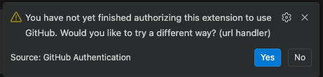

# GitHub Copilot CLI Sandbox Template

Run GitHub Copilot CLI in a network-locked container. All outbound traffic is routed through an enforcing proxy that blocks requests to domains not on the allowlist.

## Quick Start

### 1. Install agent-sandbox CLI

```bash
git clone https://github.com/mattolson/agent-sandbox.git
export PATH="$PWD/agent-sandbox/cli/bin:$PATH"
```

### 2. Initialize the sandbox for your project

```bash
agentbox init
```

Select "copilot" when prompted for the agent type, and choose your preferred mode (devcontainer or CLI).

### 3. Start the sandbox

**Devcontainer (VS Code / JetBrains):**

VS Code:
1. Install the Dev Containers extension
2. Command Palette > "Dev Containers: Reopen in Container"

JetBrains (IntelliJ, PyCharm, WebStorm, etc.):
1. Open your project
2. From the Remote Development menu, select "Dev Containers"
3. Select the devcontainer configuration

**CLI (terminal):**

```bash
agentbox exec
```

### 4. Authenticate Copilot (first run only)

In CLI mode you should be able to `/login` as usual.

When using VS Code (devcontainer), you need to use the "URL handler" method.

[](../../docs/images/copilot-auth-vscode-ide.png)

Note: even in Devcontainer mode, VS Code will store the credentials on the host (removing the containers and volumes preserves them).

The IntelliJ Copilot plugin [cannot complete the authentication flow in a Devcontainer](https://github.com/microsoft/copilot-intellij-feedback/issues/1375),
so it's impossible to use it.

### 5. Use Copilot CLI

Inside the container:

```bash
copilot
# or auto-approve mode:
copilot --yolo
```

Afterward, for CLI mode, stop the container:

```bash
agentbox compose down
```

## How It Works

Two containers run as a Docker Compose stack:

1. **proxy** (mitmproxy) - Enforces a domain allowlist. Blocks HTTP and HTTPS requests to non-allowed domains with 403. Logs all traffic as JSON to stdout.
2. **agent** (Copilot CLI) - Your development environment. All HTTP/HTTPS traffic is routed through the proxy via `HTTP_PROXY`/`HTTPS_PROXY` env vars. An iptables firewall blocks any direct outbound connections, so traffic cannot bypass the proxy.

The proxy's CA certificate is automatically shared with the agent container and installed into the system trust store at startup.

## Network Policy

### Policy location

The network policy lives in your project at `.devcontainer/policy.yaml`. This file is checked into version control and shared with your team.

The `.devcontainer/` directory is mounted read-only inside the agent container, preventing the agent from modifying the policy, compose file, or devcontainer config. The proxy only reads the policy at startup, so even if the file were changed, it would not take effect until a human restarts the proxy from the host.

### Customizing the policy

To edit the network policy:

```bash
agentbox policy
```

This opens the policy file in your editor. If you save changes, the proxy service will automatically restart to apply the new policy.

Example policy:

```yaml
services:
  - github
  - copilot
  - vscode
  - jetbrains

domains:
  # Add your own
  - registry.npmjs.org
  - pypi.org
```

### Policy format

```yaml
services:
  - github  # Expands to github.com, *.github.com, *.githubusercontent.com
  - vscode  # Expands to VS Code infrastructure domains

domains:
  - api.githubcopilot.com  # Exact match
  - "*.example.com"        # Wildcard suffix match (also matches example.com)
```

## Verifying the Sandbox

```bash
# Inside container:

# Should fail with 403 (blocked by proxy)
curl -s -o /dev/null -w "%{http_code}" https://example.com

# Should succeed (GitHub is allowed)
curl -s https://api.github.com/zen

# Direct outbound bypassing proxy should also fail (blocked by iptables)
curl --noproxy '*' --connect-timeout 3 https://example.com
```

## Dotfiles

Mount your dotfiles directory to have them auto-linked into `$HOME` at container startup:

```yaml
volumes:
  - ${HOME}/.config/agent-sandbox/dotfiles:/home/dev/.dotfiles:ro
```

The entrypoint recursively walks `~/.dotfiles` and creates symlinks for each file at the corresponding `$HOME` path. Intermediate directories are created as needed.

For example, if your dotfiles contain:
```
.dotfiles/
  .zshrc
  .gitconfig
  .config/
    git/config
    starship.toml
```

The container will have:
- `~/.zshrc` -> `~/.dotfiles/.zshrc`
- `~/.gitconfig` -> `~/.dotfiles/.gitconfig`
- `~/.config/git/config` -> `~/.dotfiles/.config/git/config`
- `~/.config/starship.toml` -> `~/.dotfiles/.config/starship.toml`

Protected paths (`.config/agent-sandbox`) are never overwritten. Shell-init hooks are sourced from the system-level zshrc (`/etc/zsh/zshrc`), which runs before `~/.zshrc`, so your dotfiles can include a custom `.zshrc` without breaking agent-sandbox functionality.

## Shell Customization

Mount scripts into `~/.config/agent-sandbox/shell.d/` to customize your shell environment. Any `*.sh` files are sourced when zsh starts (before `~/.zshrc`).

```bash
mkdir -p ~/.config/agent-sandbox/shell.d

cat > ~/.config/agent-sandbox/shell.d/my-aliases.sh << 'EOF'
alias ll='ls -la'
alias gs='git status'
EOF
```

The `agentbox init` command prompts whether to enable shell customizations when setting up your project.

## Language Stacks

The base image ships installer scripts for common language stacks. Use them in a custom Dockerfile or via the `STACKS` build arg.

### Custom Dockerfile

```dockerfile
FROM ghcr.io/mattolson/agent-sandbox-copilot:latest
USER root
RUN /etc/agent-sandbox/stacks/python.sh
RUN /etc/agent-sandbox/stacks/go.sh 1.23.6
USER dev
```

Build and use your custom image:
```bash
docker build -t my-copilot-sandbox .
agentbox compose edit
# Update the agent service image to: my-copilot-sandbox
```

### STACKS build arg

If building from source, use the `STACKS` env var. Stacks are installed in the base image, so build with `all` or build base first:

```bash
STACKS="python,go:1.23.6" ./images/build.sh all
```

### Available stacks

| Stack | Script | Version arg | Default |
|-------|--------|-------------|---------|
| Python | `python.sh` | (ignored, uses apt) | System Python 3 |
| Node.js | `node.sh` | Major version | 22 |
| Go | `go.sh` | Full version | 1.23.6 |
| Rust | `rust.sh` | Toolchain | stable |

Each script handles both amd64 and arm64 architectures.

## Image Versioning

The `agentbox init` command automatically pulls the latest images and pins them to their digests for reproducibility.

To update to newer image versions later:

```bash
agentbox compose bump
```

This pulls the newest versions and updates the compose file with the new pinned digests.

To use locally-built images instead:

```bash
cd agent-sandbox && ./images/build.sh
agentbox compose edit
# Update the images to use:
#   agent service: agent-sandbox-copilot:local
#   proxy service: agent-sandbox-proxy:local
```

## Troubleshooting

### Proxy health check fails

The agent container waits for the proxy to be healthy before starting. If the proxy fails to start, check its logs:

```bash
agentbox compose logs proxy
```
